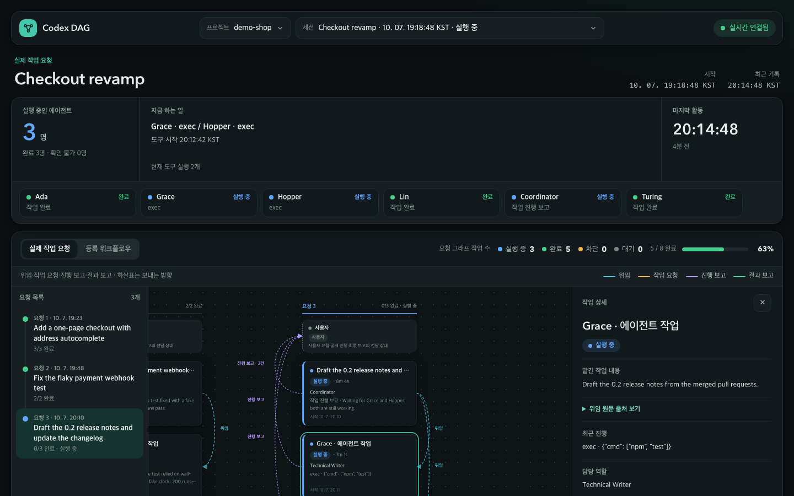
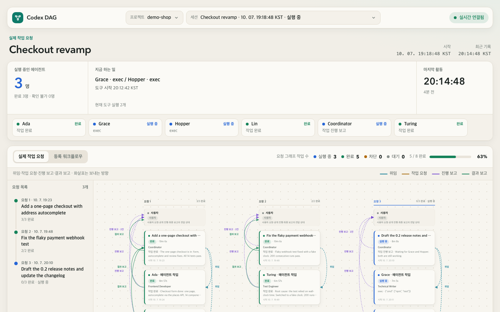

# Codex DAG

**Codex 에이전트가 무엇을 하고 있는지, 실시간 그래프로 봅니다.**

Codex DAG는 [OpenAI Codex](https://openai.com/codex/) 세션을 위한 작은 로컬 모니터입니다. 기록은 읽기만 합니다.
Codex에게 맡긴 요청과 그 요청이 띄운 서브에이전트를 실시간 DAG로 그려서, 누가 누구에게 무엇을 맡겼는지,
어떤 에이전트가 아직 실행 중인지, 각자 무엇을 언제 보고했는지 한눈에 보여 줍니다.

[English](README.md) · [MIT 라이선스](LICENSE)

## 다운로드

| | 다운로드 | 요구 사항 |
| --- | --- | --- |
| **macOS** | [**Codex-DAG-macOS-arm64.dmg**](https://github.com/codesholic/codex-dag/releases/latest/download/Codex-DAG-macOS-arm64.dmg) | Apple Silicon, macOS 15 이상 |
| **Windows** | [**Codex-DAG-Windows-x64-Setup.exe**](https://github.com/codesholic/codex-dag/releases/latest/download/Codex-DAG-Windows-x64-Setup.exe) | Windows 10/11 x64 |

링크는 항상 최신 릴리스를 받습니다. 체크섬(`SHA256SUMS.txt`)과 이전 버전은
[Releases](https://github.com/codesholic/codex-dag/releases) 페이지에 있습니다. 서명 없는 빌드의 첫 실행 방법은 [설치](#설치)를 보세요.



## 만들게 된 이유

[OmO](https://omo.dev)가 여러 웨이브로 이어지는 에이전트 작업을 DAG로 펼쳐 보여 주는 걸 보고, 문득 코덱스 앱에서 사용하는것을 적용 해보면 좋겠다는 생각으로 재미삼아 만들어 봤어요.

그나저나 OmO 데스크톱 앱 많이 기대 됩니다. 빨리 나왔으면 좋겠습니다.

## 주요 기능

- **요청 목록** — 세션의 모든 요청과 진행 상태. 누르면 그래프가 그 요청으로 이동합니다.
  큰 세션은 읽기 어려운 축소 화면 대신 최신 요청을 읽을 수 있는 배율로 엽니다.
- **실시간 에이전트 그래프** — 실제 에이전트 실행마다 카드 하나, 위임·작업 요청·진행 보고·결과 보고 선
  (화살표는 보내는 쪽 → 받는 쪽). 선을 누르면 실제 전달 원문과 연결 근거를 볼 수 있습니다.
- **실시간 현황** — 실행 중인 에이전트 수, 지금 하는 일, 마지막 활동, 에이전트별 상태 칩.
- **협업 메시지와 실행 기록** — 공개 진행 보고, 최종 보고, 도구 실행 기록. 모든 원본 기록을 바로 펼쳐 볼 수 있습니다.
- **메뉴바/트레이 앱** — 수집기 시작·중지·재시작, 모니터 창 열기, Codex 데이터 폴더 변경, 로그 열기.
- 시스템 설정을 따르는 **밝은/어두운 테마**.



## 동작 방식

```
~/.codex (읽기 전용) ──► Python 수집기 ──► 127.0.0.1 서버 ──SSE──► 모니터 창
선택: 공개 저널 ─────────┘  (표준 라이브러리만)   (실행마다 새 토큰)     (WKWebView / Electron)
```

- 수집기는 Codex의 로컬 세션 기록(`~/.codex/sessions/**/*.jsonl`)을 이어서 읽기만 하고 Codex 폴더에 쓰지 않습니다.
  세션 이름은 Codex 앱 메타데이터의 임시 사본에서 읽습니다.
- 에이전트 사이 메시지 본문은 Codex 로컬 기록에서 암호화돼 있습니다. 에이전트가 보내는 공개 원문을 로컬 **공개 저널**
  (`scripts/journal-public.py`)에 남기면 Codex DAG가 실제 전달과 연결해 보여 주며, 추정 연결은 항상 추정이라고 표시합니다.
- 서버는 `127.0.0.1`에서만 열리고 실행마다 새 토큰을 쓰며, 실시간 갱신은 SSE로 보냅니다.
- 비공개 추론은 수집하지 않고 암호화된 내용을 복호화하지 않습니다.

## 설치

| 플랫폼 | 파일 | 방법 |
| --- | --- | --- |
| macOS 15+, Apple Silicon | [`Codex-DAG-macOS-arm64.dmg`](https://github.com/codesholic/codex-dag/releases/latest/download/Codex-DAG-macOS-arm64.dmg) | DMG를 열고 `Codex DAG.app`을 응용 프로그램 폴더로 끌어 놓습니다. 메뉴바에 나타납니다. |
| Windows 10/11 x64 | [`Codex-DAG-Windows-x64-Setup.exe`](https://github.com/codesholic/codex-dag/releases/latest/download/Codex-DAG-Windows-x64-Setup.exe) | 설치 파일을 실행합니다(현재 사용자 설치, 관리자 권한 불필요). 시스템 트레이에 나타납니다. |

두 설치 파일 모두 Python 런타임을 포함하므로 따로 설치할 것이 없습니다.

빌드는 **서명·공증되지 않았습니다**.

- **macOS** — 처음 실행할 때 앱을 우클릭해 *열기*를 고르거나,
  `xattr -dr com.apple.quarantine "/Applications/Codex DAG.app"`을 실행합니다.
- **Windows** — SmartScreen이 뜨면 *추가 정보 → 실행*을 고릅니다.

설치 후 메뉴바나 트레이에서 모니터를 열고, 프로젝트 폴더를 연결한 뒤 세션을 고르면 됩니다.
프로젝트 경로는 Codex 앱에서 선택한 프로젝트로 자동으로 채워집니다.

앱 데이터 위치: macOS `~/Library/Application Support/Codex DAG`, Windows `%LOCALAPPDATA%\Codex DAG`.

## 소스에서 빌드

백엔드는 Python 표준 라이브러리만 씁니다(Python 3.10 이상).

```sh
./scripts/test.sh                 # 백엔드 테스트
npm test --prefix windows         # Windows 호스트 테스트 (npm ci --prefix windows 이후)
./scripts/start-dev.sh            # 개발 모니터 http://127.0.0.1:58957/ (소스 실행 전용, 토큰 없음)
```

**macOS 앱과 DMG** (Apple Silicon, Xcode Command Line Tools):

```sh
python3 packaging/macos/prepare-runtime.py   # 고정된 python.org 런타임과 빌드 도구를 .local/에 준비
./scripts/build-macos.sh                     # → dist/Codex DAG.app, dist/Codex DAG.dmg
```

**Windows 설치 파일** (Windows에서는 `python packaging/windows/build.py`, macOS에서는 Node.js/npm과 Rosetta 2 필요):

```sh
./scripts/build-windows.sh                   # → dist/Codex-DAG-<버전>-Setup-x64.exe
```

릴리스 첨부용 고정 이름 파일과 체크섬은 `./scripts/prepare-release.sh`로 `dist/release/`에 만듭니다.

### 공개 메시지 기록 (선택)

에이전트 사이 전달의 실제 본문을 보여 주려면, 보내는 에이전트가 보내기 직전에 기록합니다.

```sh
python3 scripts/journal-public.py --project /path/to/project --session "$CODEX_THREAD_ID" \
  --from-agent /root --to-agent /root/reviewer --kind assignment --role Reviewer \
  --message-file message.txt
```

`--collaboration-call-id`에는 실제 Codex 호출 ID만 넣고, `--assignment-id`는 작성자가 정하는 작업 ID입니다.

## 한계

- Codex의 로컬 기록 형식은 공개 API가 아니어서 Codex 업데이트로 바뀔 수 있습니다.
- 화면 문구는 현재 한국어입니다.
- 릴리스 빌드는 macOS ad-hoc 서명, Windows 서명 없음입니다. Intel Mac은 지원하지 않습니다.
- Windows 빌드는 교차 빌드이며 macOS 앱보다 실제 기기 검증이 적습니다.

## 고지

Codex DAG는 독립적인 비공식 프로젝트입니다. OpenAI나 OmO 프로젝트와 제휴·보증·후원 관계가 없습니다.
"Codex"와 "OmO"는 각 소유자의 이름입니다.

## 라이선스

[MIT](LICENSE) © 2026 codesholic
